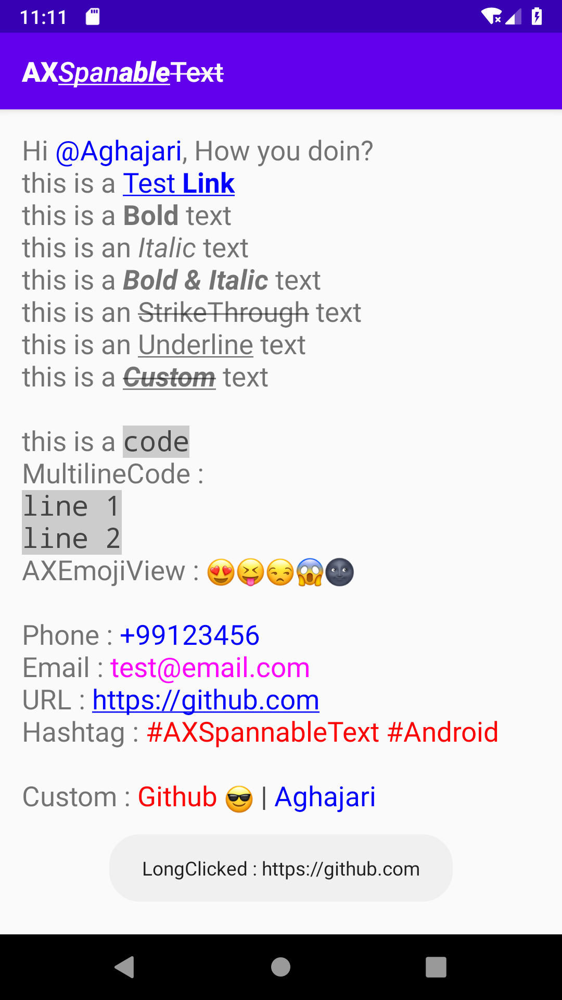

# AXSpannableText
**AXSpannableText** supports Hashtag(#), Mention(@), URLs, Phone, Email, Markdown, etc and ability to handle clicks and long clicks in all TextView widgets (**TextView**, **Button**, **Switch**, **CheckBox**, etc), **Toasts** and all other places that accept **Spanned content**. (Useable for Messengers and Chat pages)



## Supported Types
- [MarkdownStyleSpanType](#MarkdownStyleSpanType)
  - **Bold**
  - *Italic*
  - _**Bold & Italic**_
- [StrikethroughSpanType](#StrikethroughSpanType)
  - ~~Strikethrough~~
- [UnderlineSpanType](#UnderlineSpanType)
  - <ins>Underline</ins>
- [MarkdownLinkSpanType](#MarkdownLinkSpanType)
- [MarkdownMonospaceSpanType](#MarkdownMonospaceSpanType)
  - `CODE`
- [MarkdownMultilineMonospaceSpanType](#MarkdownMultilineMonospaceSpanType)
- [MentionSpanType](#MentionSpanType)
  - `@Mention`
- [HashtagSpanType](#HashtagSpanType)
  - `#Hashtag`
- [UrlSpanType](#UrlSpanType)
- [PhoneSpanType](#PhoneSpanType)
- [EmailSpanType](#EmailSpanType)

## Table of Contents  
- [Installation](#installation)  
- [Usage](#usage)
- [Customization](#customization)
- [Clickable Span](#Clickable-Span)
- [Customize SpanType Groups](#Customize-SpanType-Groups)
- [CustomSpanType](#CustomSpanType)
- [Syntax Guide](#Syntax-Guide)
  - [MarkdownStyleSpanType](#MarkdownStyleSpanType)
  - [StrikethroughSpanType](#StrikethroughSpanType)
  - [UnderlineSpanType](#UnderlineSpanType)
  - [MarkdownLinkSpanType](#MarkdownLinkSpanType)
  - [MarkdownMonospaceSpanType](#MarkdownMonospaceSpanType)
  - [MarkdownMultilineMonospaceSpanType](#MarkdownMultilineMonospaceSpanType)
  - [MentionSpanType](#MentionSpanType)
  - [HashtagSpanType](#HashtagSpanType)
  - [UrlSpanType](#UrlSpanType)
  - [PhoneSpanType](#PhoneSpanType)
  - [EmailSpanType](#EmailSpanType)
  - [Emoji](#Emoji)
- [Author](#author)
- [License](#license)

## Installation

AXSpannableText is available in the JCenter, so you just need to add it as a dependency (Module gradle)

Gradle
```gradle
implementation 'com.aghajari.spannabletext:AXSpannableText:1.0.0'
```

Maven
```xml
<dependency>
  <groupId>com.aghajari.spannabletext</groupId>
  <artifactId>AXSpannableText</artifactId>
  <version>1.0.0</version>
  <type>pom</type>
</dependency>
```

## Usage

First you need to create your own AXSpannableText and add the SpanTypes which you want.
```java
AXSpannableText spannableText = new AXSpannableText();
spannableText.addType(new MarkdownStyleSpanType());
spannableText.addType(new StrikethroughSpanType());
spannableText.addType(new UnderlineSpanType());
...
```

Example :
```java
textView.setMovementMethod(new AXLinkMovementMethod());
textView.setText(spannableText.create("Hi @Aghajari, How you doin?\n"+
        "this is a [Test **Link**](https://google.com)\n"+
        "this is a **Bold** text\n"+
        "this is an *Italic* text\n"+
        "this is a ***Bold & Italic*** text\n"+
        "this is an ~~StrikeThrough~~ text\n"+
        "this is an ++Underline++ text\n"+
        "this is a ***~~++Custom++~~*** text\n\n"+
        "this is a `code`\n"+
        "MultilineCode : \n```line 1\nline 2```\n"+
        "AXEmojiView : \uD83D\uDE0D\uD83D\uDE1D\uD83D\uDE12\uD83D\uDE31\uD83C\uDF1A \n\n"+
        "Phone : +99123456\n"+
        "Email : test@email.com\n"+
        "URL : https://github.com\n"+
        "Hashtag : #AXSpannableText #Android\n\n"+
        "Custom : [Github \uD83D\uDE0E | Aghajari]"));
```

## Customization
You can customize text style

```java
spannableText.addType(new MY_SPAN_TYPE(){
            @Override
            public void applyTextStyle(AXSpanRange range, TextPaint textPaint, boolean isPressed) {
                super.applyTextStyle(range,textPaint,isPressed);
                textPaint.setColor(Color.RED);
                // Customize typeface, textSize, textColor, backgroundColor, etc
            }
        });
```

## Clickable Span
You can enable click or long click for any spans

```java
spannableText.addType(new MY_SPAN_TYPE(){

            @Override
            protected void init() {
                super.init();
                setLongClickable(true);
                setClickable(true);
            }

            @Override
            public void onSpanClick(@NonNull View view, AXSpanRange range) {
                super.onSpanClick(view, range);
                Toast.makeText(view.getContext(),getLinkValue(range),Toast.LENGTH_SHORT).show();
            }

            @Override
            public void onSpanLongClick(@NonNull View view, AXSpanRange range) {
                super.onSpanLongClick(view, range);
                Toast.makeText(view.getContext(),"LongClicked : "+range.getMatchedText(),Toast.LENGTH_SHORT).show();
            }
        });
```

## Customize SpanType Groups
You can customize an span type groups

For example, in MentionSpanType, you can set `@` and `Username` colors with two different values :

```java
spannableText.addType(new MentionSpanType() {
            @Override
            protected void init() {
                super.init();
                // @Username -> Group1: @ , Group2: Username
                addGroupSpan(1,new ForegroundColorSpan(Color.RED));
                addGroupSpan(2,new ForegroundColorSpan(Color.BLUE));
            }
});
```
It's useable for custom spans

## CustomSpanType
You can create any custom span type by a regex pattern

```java
spannableText.addType(new CustomSpan());
```

```java
// CustomSpan
// [INFO|ID] -> INFO|ID
public static class CustomSpan extends AXSpannableStyleType {

        public CustomSpan(){
            super();

            // INFO : ForegroundColorSpan(RED)
            addGroupSpan(1,new ForegroundColorSpan(Color.RED));
            // ID : ForegroundColorSpan(BLUE)
            addGroupSpan(2,new ForegroundColorSpan(Color.BLUE));

            // ClickableSpan
            setClickable(true);
        }

        @Override
        public Pattern getRegexPattern() {
            return Pattern.compile("\\[(\\s*[^*]*)\\|(\\s*[^*]*)\\]");
        }

        @Override
        public void applyTextStyle(AXSpanRange range, TextPaint textPaint, boolean isPressed) {
            super.applyTextStyle(range, textPaint, isPressed);
            textPaint.setColor(Color.DKGRAY);
            textPaint.setUnderlineText(isPressed);
        }

        @Override
        public boolean isValidRange(AXSpanRange range) {
            // check if INFO & ID exists
            if (range.getGroups() == null || range.getGroups().size()!=2) return false;
            return super.isValidRange(range);
        }

        @Override
        protected int getStartTransparentLength(AXSpanRange range) {
            return 1; // remove [ at the start
        }

        @Override
        protected int getEndTransparentLength(AXSpanRange range) {
            return 1; // remove ] at the end
        }

        @Override
        public void onSpanClick(@NonNull View view, AXSpanRange range) {
            super.onSpanClick(view, range);
            Toast.makeText(view.getContext(),range.getMatchedText(),Toast.LENGTH_SHORT).show();
        }
}
```

## Syntax Guide
Here’s an overview of AXSpannableText supported syntax.

### MarkdownStyleSpanType

Example :
```
It's very easy to make some words **bold** and other words *italic* or ***bold & italic** with Markdown.
```
Output :

It's very easy to make some words **bold** and other words *italic* or ***bold & italic*** with Markdown.

### StrikethroughSpanType
Any word wrapped with two tildes (like `~~this~~`) will appear crossed out.

Example : `this is an ~~Strikethrough~~ text`

Output : this is an ~~Strikethrough~~ text

### UnderlineSpanType
Any word wrapped with two plus symbol (like `++this++`) will be underlined.

Example : `this is an ++Underline++ text`

Output : this is an <ins>Underline</ins> text

### MarkdownLinkSpanType
Any text converted into a clickable (or longclickable) link.

Example : `[link to Google!](http://google.com)`

Output : [link to Google!](http://google.com)

### MarkdownMonospaceSpanType
Here’s an example of how you can use syntax highlighting :

Example : ``` `Code` ```

Output : `Code`

### MarkdownMultilineMonospaceSpanType
Here’s an example of how you can use multiline syntax highlighting :

Example : 
```
```Line1
Line2```
```

Output :
```
Line1
Line2
```

### MentionSpanType
> **Github:** Typing an `@` symbol, followed by a username, will notify that person to come and view the comment. This is called an “@mention”, because you’re mentioning the individual.

> **Wikipedia:** A mention (also known as @replies or tagging) is a means by which a blog post references or links to a user's profile.

### HashtagSpanType
> **Wikipedia:** A hashtag is a metadata tag that is prefaced by the hash symbol, #.

### UrlSpanType
Any URL will be automatically converted into a clickable (or longclickable) link.

[Check out supported URLs](https://regex101.com/r/vra7ib/1)

### PhoneSpanType
Any Phone number will be automatically converted into a clickable (or longclickable) link.

### EmailSpanType
Any Email address will be automatically converted into a clickable (or longclickable) link.

### Emoji
AXSpannableText supports using [AXEmojiView](https://github.com/Aghajari/AXEmojiView) or any other emoji views


## Author 
- **Amir Hossein Aghajari**

License
=======

    Copyright 2020 Amir Hossein Aghajari
    Licensed under the Apache License, Version 2.0 (the "License");
    you may not use this file except in compliance with the License.
    You may obtain a copy of the License at

       http://www.apache.org/licenses/LICENSE-2.0

    Unless required by applicable law or agreed to in writing, software
    distributed under the License is distributed on an "AS IS" BASIS,
    WITHOUT WARRANTIES OR CONDITIONS OF ANY KIND, either express or implied.
    See the License for the specific language governing permissions and
    limitations under the License.


<br><br>
<div align="center">
  
  <br><a>Amir Hossein Aghajari</a> • <a href="mailto:amirhossein.aghajari.82@gmail.com">Email</a> • <a href="https://github.com/Aghajari">GitHub</a>
</div>
